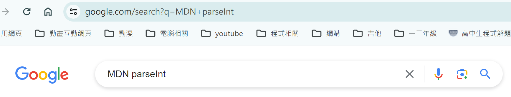
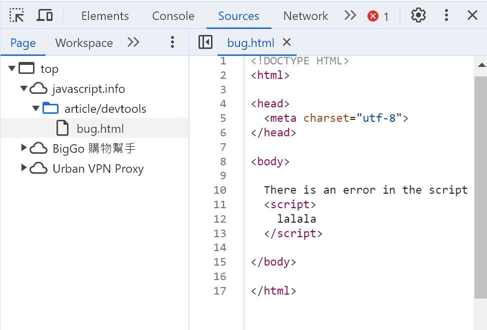
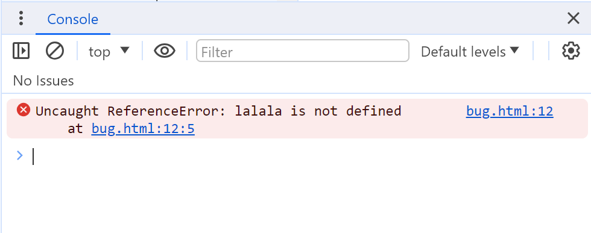
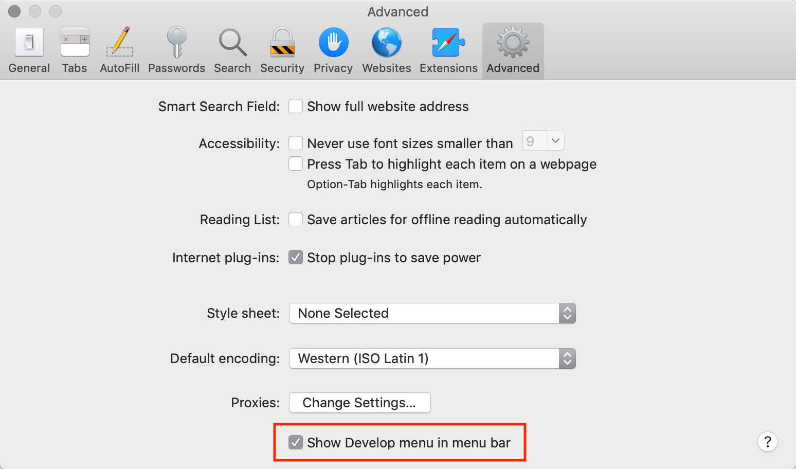

## 第一章內容太少，所以全部放在 README.md 裡面

# 1.1 An introduction

* ECMAScript 是 JavaScript 腳本語言的標準
* JavaScript 不提供對記憶體或 CPU 的低階訪問
* JavaScript 的功能很大程度上取決於它運行的環境
    * 例如，Node.js支援允許 JavaScript 讀取/寫入任意檔案、執行網路請求等功能。

* 瀏覽器內的 JavaScript 能夠：
    * 為頁面新增新的 HTML、變更現有內容、修改樣式。
    * 對使用者操作做出反應，透過滑鼠點擊、指標移動、按鍵來運行。
    * 透過網路向遠端伺服器發送請求、下載和上傳檔案（所謂的 AJAX 和 COMET 技術）。
    * 取得和設定 cookie、向訪客提問、顯示訊息。
    * 記住客戶端的資料（“本地儲存”）。

* AJAX：網頁可以透過 JavaScript 進行修改以動態顯示（無須重新載入頁面），並允許使用者與新資訊互動。

* COMET：長期持有的 HTTPS 請求允許 Web 伺服器將資料推送到瀏覽器，而無需瀏覽器明確請求。
    * 近年來，WebSocket和伺服器發送事件的標準化和廣泛支援使得 Comet 模型變得過時。

---

# 1.2 Specification (規格)

ECMA-262 規範包含有關 JavaScript 的最深入、最詳細和最正式的資訊

# Manuals (手冊)

https://google.com/search?q=MDN+parseInt，即可搜尋該parseInt函數。

---

# 1.3 Code editors

Integrated development environment (IDE)，整合開發環境
* Visual Studio Code（跨平台，免費）。
* WebStorm（跨平台，付費）。

輕量級編輯器
* Sublime Text（跨平台，共享軟體）。
* Notepad++（Windows，免費）。
* 如果您知道如何使用 Vim 和 Emacs ，它們也很酷。

No, I don't think so，Vim 超難用

---

# 1.4 Developer console (開發者控制台)
* 在瀏覽器中，使用者預設看不到錯誤。因此，如果腳本中出現問題，我們將看不到損壞的地方，也無法修復它。

這是練習 JavaScript 錯誤的頁面：https://javascript.info/article/devtools/bug.html

* Window：F12
* Mac：Cmd+Opt+J

在底下 Console，有顯示錯，點下去，會跳轉到 Sources

錯誤訊息下方有一個藍色>符號。它標誌著一個“命令列”，我們可以在其中輸入 JavaScript 命令

* Firefox、Edge...等，大多數其他瀏覽器用於F12開啟開發人員工具。

### Safari (蘋果瀏覽器)
* 需要開啟 “Develop menu” 中的 Show Develop menu in menu bar 

* 接著，使用組合鍵，Cmd+Opt+C