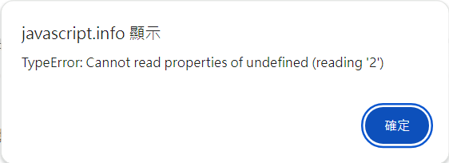

# Code structure

### Statements (陳述句)
* 雖然 `alert('Hello'); alert('World');` 寫在一行和分行寫代表意思是一樣的，但分行寫更有閱讀性

### Semicolons (分號)
* 在 JavaScript 中，還是習慣在句尾加分號

    * 錯誤範例
    ```
    alert("Hello");

    [1, 2].forEach(alert);
    ```
    
    
    

    * 如果把第一句的分號拿掉
    ```
    alert("Hello")

    [1, 2].forEach(alert);
    ```
    
    

    * 而 engine 是這樣解讀的 `alert("Hello")[1, 2].forEach(alert);`


### Comments

``` JavaScript
// This comment occupies a line of its own
/*
*/
```