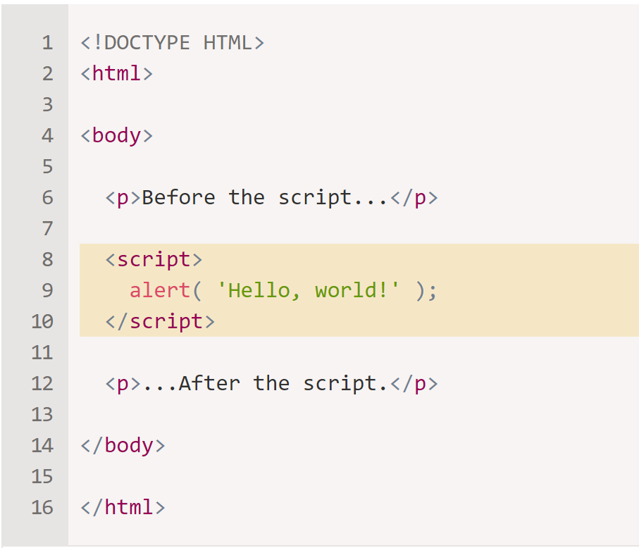
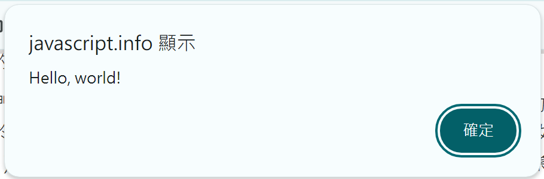

# 2.1 Hello, World
###  The “script” tag

\<script\> tag 幾乎可以插入 HTML 文件中的任何位置


執行後，就會跳出這個視窗



### 現代標記
* 現在仍存在一些舊有的標籤，但現在已經很少使用
    * type
    * language

#### type
* 舊的 HTML 標準 HTML4 要求腳本具有type
* 通常是這樣type="text/javascript"

#### language
* \<script language=…\>
* 該屬性旨在顯示腳本的語言。該屬性不再有意義，因為 JavaScript 是預設語言。沒有必要使用它。

#### 程式中的註解
```javascript
<script type="text/javascript"><!--
    ...
//--></script>
```
* 現代 JavaScript 中沒有使用這個技巧，這種註釋可以幫助您識別真正舊的程式碼。

### 外部腳本
* 如果我們有很多 JavaScript 程式碼，我們可以將其放入一個單獨的檔案中。
* 腳本檔案透過以下屬性附加到 HTML src：
```
<script src="/path/to/script.js"></script>
```
* 網址可以使用從網站的根目錄到腳本，也可以使用相對路徑，也可以使用完整的 URL
* 若要附加多個腳本，請使用多個標籤：

* <font color=#00A2E8>通常，只有最簡單的腳本才會被放入 HTML 中。複雜的位於單獨的文件中。
    * 單獨的好處是瀏覽器可以將它下載然後儲存至 cache 中
    * Web Cache： (or HTTP cache)，是一種用於最佳化萬維網的系統。
* 引用相同腳本的其他頁面將從快取中獲取該腳本而不是下載它，因此該檔案實際上只下載一次。這可以減少流量並使頁面速度更快。</font>

* <font color=#FF6600>如果在 `<script>` 中有 src 屬性，`<script src=...>`，包含程式碼，程式碼會被忽略
</font>	

```JavaScript
<script src="file.js">
  alert(1); // the content is ignored, because src is set
</script>
```
* 必須分成兩區塊寫
```JavaScript
<script src="file.js"></script>
<script>
  alert(1);
</script>
```